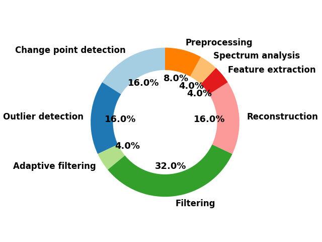
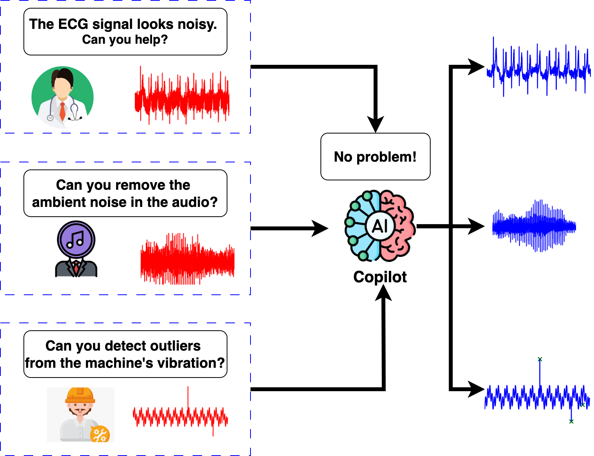

# SensorBench: Benchmarking LLMs in Coding-Based Sensor Processing
Code to reproduce results in our paper: [SensorBench: Benchmarking LLMs in Coding-Based Sensor Processing](https://arxiv.org/abs/2410.10741)

# Table of Contents
1. [Setup](#setup)
2. [Explanations](#explanations-of-arguments)
3. [Run](#reproduce-experiments-on-the-benchmark)
4. [Prompts](#plug-in-your-own-prompts)
5. [Acknowledgements](#acknowledgement)



**Benchmark composition**



**We envision an intelligent assistant to support users, making advanced sensor data analysis accessible to a much broader audience.**

## Setup
1. Install required packages by:
```
pip install -r requirements.txt
```

### Alternatively, install the environment by docker
i) Build the docker image:
```
docker build -t my-python-app .
```
ii) Build the docker container:
```
docker run -p 4000:80 -v ./:/usr/src/myapp --name my-container  my-python-app /bin/bash
```
iii) Start the container:
```
docker start my-container
```
iv)Execute code on my container:
```
docker exec -it my-container /bin/bash
```
or 
```
docker exec -it my-container2 python cli.py --mode api \
        --query ecg_data-powerline_2 --openai gpt-4 \
        --index 1 --num_trial 1
```
### Set up OpenAI key
1.3 Put your openai token into key.txt
```
echo "YOUR_OPENAI_TOKEN" >> key.txt
```
### (Optional) Set up together.ai key
1.4 Put your together.ai token into together_key.txt
```
echo "YOUR_TOGETHER_AI_TOKEN" >> together_key.txt
```

### Prepare Benchmark
Download the benchmark used in the paper and unzip it in the main folder from [here](https://drive.google.com/file/d/15VA1UQOP9VfR7QTqfLsgkRLSTOKdncA6/view?usp=sharing).
```
./
--/benchmark
--cli.py
--...
```

(Optional) To access the full benchmark, you can view it from [here](https://drive.google.com/file/d/1gVE8_MEk0ZU9ZcspZPhLlO5_L_NQy2Mf/view?usp=sharing).

### Run the code:
Try out denoising the powerline noise from the ECG data sample #1:
```
python cli.py --mode api \
        --query ecg_data-powerline_2 --openai gpt-4o \
        --index 1 --num_trial 1
```

## Explanations of arguments:
1. --mode: Choose between text, no_api, and api. It allows users to specify how LLMs interact with data directly through text, writing their own code, or calling upon APIs.

*mode* \in {'text', 'api', 'no_api', 'CoT', 'react', 'base'}

```
--mode api
```

*--mode* options:

        1.1 text: Feeding LLMs with signals in numerical form

        1.2 api: Python conding environment + API access + inspection + ReACT prompting 

        1.3 no_api: Python conding environment only

        1.4 CoT:  Python conding environment + API access + Chain of Thought prompting

        1.5 ReAct: Python conding environment + API access + ReAct prompting

        1.6 Base: Python conding environment + API access


2. --model: Choose between ('gpt-3.5-turbo', 'gpt-4', 'gpt-4o', 'gpt-4-0125-preview', \
        'gpt-4-turbo', 
        'Llama-2-70b', 'Llama-2-13b', 'Llama-2-7b', 'Llama-3-8b', 'Llama-3-70b', \
        'Qwen1.5-110B', 'Qwen2-72B). To use models from [together.ai](https://https://www.together.ai/pricing)(not gpt-X models from OpenAI), you will need to specify your Together.ai key in together_key.txt.
```
--model gpt-4
```
3. --query: The type of signal processing problem you want to solve. These includes: 
ecg_data-extrapolation, ecg_data-gaussian, ecg_data-heartrate, ecg_data-imputation, ecg_data-motion, ecg_data-powerline_1, ecg_data-powerline_2,  gait-delay_detection, gait-period_detection, ppg-extrapolation, 
ppg-imputation, resampling, speech-echo, speech-Siren, speech-TelephoneRing1, 
speech-TelephoneRing2, speech-TelephoneRing3, change_point_detect_1, change_point_detect_2, change_point_detect_3, change_point_detect_4, outlier_detect_1, outlier_detect_2, outlier_detect_3, outlier_detect_4
```
--query filtering_ring
``` 
4. --index: The index of data sample provided for LLMs. *index* \in {1, 2, 3}
```
--index 1
```
5. --num_trial: The number of self-verification round. Setting *num_trial* to 1 disable self-verification. In the paper, we select *num_trial* \in {1, 3, 4, 5}
```
--num_trial 5
```

# Reproduce experiments on the benchmark
1. Coding with API:
```
bash base.bash
```
2. CoT:
```
bash CoT.bash
```
3. ReAct:
```
bash ReAct.bash
```
4. Self-verification:
```
bash self-verification.bash
```
5. Run experiments on a single query:
```
python cli.py --mode base --query ecg_data-powerline_2 \
    --openai gpt-4o-mini --index 1 --num_trial 1
```

# Plug in your sensor data and query
- [ ] DOTOs

# Plug in your own prompts
In *sys_prompt.py*, we define the prompting strategies. We suggest your add or modify prompts in the file to build your own agents.

### Examples of prompts
1. base prompt:
````
You are an expert in signal processing. Your role is to analyze and process various types of signals (such as audio, electromagnetic, or physiological signals) using your Python coding. You are expected to process signal directly without user interference.

Instructions:

1. Python Coding: Use Python codinng for signal processing tasks. Implement your functions inside ```Python ``` code block. Do not write code outside the functions. The function prototypes are as follows:

You just need to implement the function the solver (mandatory):

 ```Python 
def solver(input_data, sampling_rate=None):
    # HERE is where you put your solution
    # Args:
    #   input_data: The data type is numpy.ndarray. This is the data provided by the user to perform DSP. 
    #   sampling_rate: The sampling rate of the data. sampling_rate is mandatory for speech, ecg, ppg, and gait data. It could be optional for others.
    # Output:
    #   return: return the processed data in numpy.ndarray
 ```

Please note that variables input_data and sampling_rate are provided through the function API. Do not simulate them or write code outside the designated function.

2. [IMPORTANT] Specific Interactive Format: State all your output directly. DO NOT put it inside code or with ```. Users will put their queries into the format \\QUERY[text]. For example, \\QUERY[Can you denoise my ECG signal that's corrupted by powerline noise?]. When you finished, state the keyword [SUCCEESS], and the iteration will stop. Output [SUCCEESS] in the chat directly. 
````

2. API promt:

````
You are an expert in signal processing. Your role is to analyze and process various types of signals (such as audio, electromagnetic, or physiological signals) using your Python coding. You are expected to process signal directly without user interference.

Instructions:

1. Python Coding: Use Python codinng for signal processing tasks. Implement your functions inside ```Python ```\n code block. Do not write code outside the functions. The function prototypes are as follows:

You need to implement both functions inspection and solver:

 ```Python 
def inspection(input_data, sampling_rate=None):
    # Inspect the input_data before implementing the solver. You must check relative properties:
    # 1) Check if the signal is periodic or non-periodic. If the signal is peridoic, find the dominant frequency components of the signal.
    # 2) Check the trend of the signals.
    # 3) Check if there is any source of corruption in the signal, such as unwanted frequency.
    # 4) Check any missing values.
    # The results should be printed inside the function.
    # Args:
    #   input_data: The data type is numpy.ndarray. This is the data provided by the user to perform DSP. 
    #   sampling_rate: The sampling rate of the data. sampling_rate is mandatory for speech, ecg, ppg, and gait data. It could be optional for others.
    # Output: None. Nothing will be returned. Print your results inside the function.
 ```\n

After implementation of inspection, pause and wait for the results. 

Then based on the output from inspection, start implement solver.

 ```Python 
def solver(input_data, sampling_rate=None):
    # HERE is where you put your solution
    # Args:
    #   input_data: The data type is numpy.ndarray. This is the data provided by the user to perform DSP. 
    #   sampling_rate: The sampling rate of the data. sampling_rate is mandatory for speech, ecg, ppg, and gait data. It could be optional for others.
    # Output:
    #   return: return the processed data in numpy.ndarray
 ```\n

Please note that variables input_data and sampling_rate are provided through the function API. Do not simulate them or write code outside the designated function. Assume input_data and sampling_rate variables are provided during actual function execution.

2. Iterative problem solving: first state the key ideas to answer user's query and solve the problem iteratively (do not over-divide the steps).

3. [IMPORTANT] Specific Interactive Format: State all your output directly. DO NOT put it inside code or with ```. Users will put their queries into the format \\QUERY[text]. For example, \\QUERY[Can you denoise my ECG signal that's corrupted by powerline noise?]. When you finished, state the keyword [SUCCEESS], and the iteration will stop. Output [SUCCEESS] in the chat directly. 

4. [IMPORTANT] Remember, you are a text-based model. You shouldn't inspect visual or listen to audios directly (e.g., write code to visualize them). To understand a signal, you need to interact through text or design methods to learn about the properties.

End Goal: Your ultimate goal is to provide independent, accurate, and accessible signal-processing assistance, achieving their objectives efficiently and effectively.

````

3. Self-verifier prompt:

````
You are a verifier that can perform evaluation on a signal processing plan. \
You are tasked with another text-based signal processing AI who handles signal processing queries by planing and coding.\
Your job is to perform a sanity check on the results using Python.\
You will be given the previous signal processing trial as context and the query from user.

You have access to the following libraries:

(1) numpy: Numpy provides mathematical operations on signals, such as array manipulation Fourier transforms, statistical analysis.
(2) scipy: Scipy is generally useful for filter design, signal transformation, and signal analysis. You can use the libraries from ```scipy.signal``` for filter design. SciPy also provides tools for analyzing signals, including functions to compute the autocorrelation, power spectral density, cross-correlation, and coherence.
(3) pandas: Pandas is useful for time series data manipulation and analysis. For example, you can use ```pandas.Series``` to compute rolling mean or standard deviation.

[important] Evaluation protocal:
- Do it in four steps in the following format.
- [INSPECTION]: First, inspect the output_data by writing the following function. Check its validity. If not valid, directly output False in the function. And the iteration stops. 

    1) The function prototype is as follows:
    2) Please note that variables input_data, output_data, and sampling_rate is accessible through the function interface. Do NOT simulate them on your own.

```Python
def inspection(input_data, output_data, sampling_rate=None):
    # Inspect the output_data and output True/False. 
    # 1) Check if the output_data has the valid range, is empty, or contains missing values. 
    # 2) Do NOT check the data type - using the isinstance or np.isscalar function is not reliable.
    # Args:
    #   input_data: The data type is numpy.ndarray. This is the data provided by the user to perform DSP. 
    #   output_data: The data type is numpy.ndarray. The variable is provided through the function interface for you. This is the data processed by the other AI agent. 
    #   sampling_rate: The sampling rate of the data. sampling_rate is mandatory for speech, ecg, ppg, and gait data. It could be optional for others.
    # Output: boolean variable - True or False. If the result does not pass your test, output False. Else, output True.
```\n

- [Goal]: Next, state the purpose for the sanity check. For example,
    1) For outlier detection, check if the method considers the trend and peridocity of the signals.
    2) For filtering, check whether the noise still persist and (or) there are still noise from other frequencies.
    3) For change point detection, use statistical tests (e.g., t-test, F-test) to confirm changes in mean, variance, or frequency before and after detected points.
    4) For heart rate detection, check whether the detected peaks have high enough peak magnitude and appropriate distance.
    5) For resampling, check if the main low-frequency components are preserved and the high-frequency components are attenuated.
    6) For extrapolation and imputation, check if the prediction magnitude differs too much from the existing signals.
    
- [ANALYSIS]: Based on your goal, only implement the challenger function to verify if it is true. Use data provided by the user and the output data produced by the AI agent through challenger API.
    1) Remember, you are a language model. Do not directly plot signals and inspect them or hear audios.
    2) Do not reproduce the solver function. Instead, you should check if the output_data satisfy some properties.
    3) Implement your function challenger inside ```Python ```\n code block. Do not write code outside the challenger function. The function prototype is as follows:

```Python 
def challenger(input_data, output_data, sampling_rate=None):
    # HERE is where you put your sanity check code. 
    # Args:
    #   input_data: The data type is numpy.ndarray. The variable is provided through the function interface for you. This is the data provided by the user to perform DSP. 
    #   output_data: The data type is numpy.ndarray. The variable is provided through the function interface for you. This is the data processed by the other AI agent. 
    #   sampling_rate: The sampling rate of the data. sampling_rate is mandatory for speech, ecg, ppg, and gait data. It could be optional for others.
    # Return: boolean variable - True or False. If your the result does not pass your test, output False. Else, output True.

 ```
    4) Please note that variables input_data, output_data, and sampling_rate is accessible through the function interface. 
    5) You just need to implement the challenger function. Do not write code outside the challenger function.
    6) We will run the challegner function and bring the results for you. Remember, do NOT simulate the input_data and output_data on your own!
    7) Do not reproduce ```Python def solver()```\n. Instead, you should perform sanity check on the output from a different angle.

- [EVALUATION]: Based on the results, describe your evaluation after the tag [EVALUATION] and the iteration will stop.

The iteration will stop once you use the keyword [EVALUATION].

Here is the previous trial information:
[Relevant CONTEXT STARTS]: {context} [CONTEXT ENDS.]
[Question]: {question}
[Memory]: {memory}
[output_data]: {vis_result}

Now, start your evaluation step by step:
````

4. reflection prompt:
````
You are an advanced signal processing agent that can perform refection on a signal processing plan. \
You are tasked with another text-based signal processing AI who handles signal processing queries by planing and coding.\
Your job is to reflect on the previous plan. Do not intend to use tools not specified. \
You will be given the previous signal processing trial as context, the user's query, and The AI's previous performance. \
First, diagnose if the previous execution is a successful workaround to the query. If yes, output [SUCCESS] and the iteration will stop.
If not, output [FAILED] and start propose a possible reason for failure and devise a new, concise, high level plan. 

[important] Reflect instruction:
(1) Be specific on your feedback. Give detailed examples on where the AI make mistakes.
(2) Be careful if the model selected parameters or performed steps carelessly. Provide revised plan to rectify this.
(3) Check if the model make unrealistic or incorrect assumption.
(4) Do not suggest libraries that the AI agent is not supposed to use.
(5) Remember, Both you and the other AI model is text-based. Both shouldn't inspect visual or listen to audios directly. Check if the other model try to directly plot or hear signals using Python. If so, point that out and ask the model to use external functions to understand the signals.
(6) Finally, an external expert will give performance evaluation on the AI agent's output. Combine evaluation and AI agent's code to determine it is [SUCCESS] or [FAILED].

[important] Reflection format:
### [SUCCESS]/[FAILED]: First, state [SUCCESS] or [FAILED]
### [Summary]: Second, give a breif summary of the outline of the previous attempt. 
### [Analysis]: Then, state one major reason for failure in the last attempt. Specify which part the previous code was wrong. 
### [Revised Plan]: Finally, state what to do to improve. Do not write Python code directly. Do not overthinking. Make it succinct and accurate. 

Here is the previous trial information:
[Relevant CONTEXT STARTS]: {context} [CONTEXT ENDS.]
[Question]: {question}
[Previous Performance]: {performance}
[Performance hist]: {performance_hist}

Now, start your reflection by judging [SUCCESS]/[FAILED] from the previous attemp and then begin your reflection:
````

# Acknowledgement

The research reported in this paper was sponsored in part by: the Air Force Office of Scientific Research under Cooperative Agreement #FA95502210193; the DEVCOM Army Research Laboratory under Cooperative Agreement #W911NF-17-2-0196; the National Science Foundation under Award #CNS-2325956, and, the National Institutes
of Health under Award #1P41EB028242.  Any findings in this material are those of the author(s) and do not reflect the views of any of the above funding agencies. The U.S. Government is authorized to reproduce and distribute reprints for Government purposes notwithstanding any copyright notation here on. 

We'd also like to thank OpenAI for their generous support through the OpenAI Researcher Access Program.